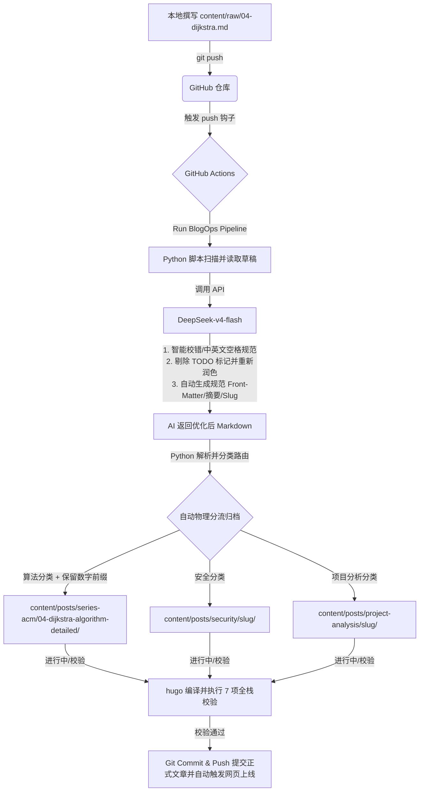

# ✍️ Eon 的个人静态博客 (Eon's Blog)

> 专注于算法竞赛、底层系统开发与硬件底层设计的个人技术博客。基于 Hugo 深度定制，融入现代前端优化与 AI 自动化发布管线，旨在打造极致轻量、高安全且完全自动化的个人名片。

🌐 **在线部署地址**: [https://blog.codequest.com.cn](https://blog.codequest.com.cn)

[](https://gohugo.io/)
[](https://platform.deepseek.com/)
[](https://developer.mozilla.org/zh-CN/docs/Web/Progressive_web_apps)
[](LICENSE)

---

## ⚡ 核心工程与性能优化亮点 (Core Highlights)

本项目不仅仅是一个普通的静态网页，我们基于现代 Web 标准和工程最佳实践进行了多项深度重构与优化：

1. **🚀 极速页面预加载 (Instant Prefetching)**
   - 自研超轻量站内链接预加载逻辑（基于原生 DOM，完全合规 CSP）。
   - 监听鼠标悬浮（80ms 延迟防抖，防快速划过误触）与移动端 `touchstart` 触摸事件，在 `<head>` 中动态插入 `<link rel="prefetch">`。
   - 充分利用浏览器空闲带宽进行即时加载，实现跳转时的“瞬间响应”体验。

2. **📶 渐进式 Web 应用 (PWA Offline Support)**
   - 编写 `manifest.json` 与 `sw.js` (Service Worker)。
   - **Cache-First 缓存策略**：直接在本地极速加载静态 CSS/JS 和字体，减少重复请求。
   - **Network-First 导航策略**：针对文章等 HTML 页面，优先拉取最新版本，弱网或离线状态下自动无缝展示缓存。
   - **离线断网兜底单页**：断网且无缓存时，呈现精心设计的、符合 Vercel 极简设计风格的 `offline.html` 离线友好页面。

3. **🖼️ Hugo 图像压缩管道 (Image Processing)**
   - 整合 Hugo 原生图片处理机制（使用 `resources.Get` 和 `$img.Process`），自动将项目卡片等图片在编译期统一转换为高效的 WebP 压缩格式，并智能填充图像 `width` 与 `height` 属性，彻底消除累积布局偏移 (CLS)。

4. **🛡️ 严苛的 Content-Security-Policy (CSP) 安全防护**
   - 部署了极度收敛的安全标头，完全移除 `'unsafe-inline'`。
   - 提取并注册了主题切换等内联脚本的 SHA-256 哈希值，建立严格的框架 (Giscus) 与 API 连接白名单，阻断潜在的跨站脚本攻击 (XSS)。

5. **🔍 高安全本地静态搜索**
   - 纯静态化 `fuse.js` 本地集成，编译期自动生成 `index.json` 全文索引，无任何外部调用或内联脚本污染。

---

## 🤖 AI 自动化写作与发布管线 (BlogOps Pipeline)

我们利用 **DeepSeek-v4-flash** API 打造了一套全自动的“草稿-润色-分类-校验-上线”写作流：



---

## 📂 目录结构总览 (Directory Structure)

```text
blog-hugo/
├── .github/workflows/        # ⚙️ GitHub Actions 自动化流水线配置
├── assets/
│   ├── css/extended/fonts.css # 🔤 本地托管字体加载样式
│   └── js/theme-footer.js    # ⚡ 预加载逻辑与 Service Worker 注册
├── content/
│   ├── raw/                  # ✍️ 草稿箱（草稿写作于此）
│   ├── posts/                # 🚀 正式发布文章分类归档
│   │   ├── series-acm/       #   - 1. ACM 算法竞赛（保留数字前缀进行排序）
│   │   ├── security/         #   - 2. 二进制/底层安全研究
│   │   └── project-analysis/ #   - 3. 开源项目分析与系统架构
│   ├── about/                # 关于我页面 (精简核心技术标签)
│   └── journey/              # 成长历程时光轴
├── data/                     # 友链 (friends.yml) 与精选项目数据 (projects.yml)
├── layouts/                  # 定制化布局模板 (时光轴、友链卡片墙等)
├── scripts/
│   ├── blogops.py            # AI 发布管线处理脚本
│   └── verify_site.py        # 本地编译自动化校验脚本 (7项校验)
├── static/                   # 静态文件及 PWA manifest/sw/offline
└── config.yml                # 站点全局配置文件
```

---

## 🧪 自动化站点校验 (Automated Site Verification)

在静态文件发布前，`verify_site.py` 脚本会对编译结果进行 **7 项质量与性能检查**：

1. **Favicon 渲染检查**：确保 16x16、32x32、Apple Touch、Safari 等图标全部正常加载。
2. **CSP 标头保护检查**：检测是否彻底移除了不安全的 `'unsafe-inline'`。
3. **外部链接安全性检查**：确保所有外部链接均带有安全的 `rel="noopener noreferrer"`，防范反向劫持。
4. **CSS 结构分离检查**：验证页面中是否存在未解耦的内联样式。
5. **本地托管字体可用性检查**：检测本地 Woff2 字体文件是否存在 404 缺失。
6. **友情链接活性检查**：自动对友链进行轻量级 HTTP 活性及 SSL 证书探测。
7. **图片体积与格式检查**：检测 `public/` 目录下所有图片体积，防止超过 300 KB 的大图影响加载速度，并推荐高效的 WebP 格式。

---

## 🧑‍💻 本地开发与写作流程 (Local Development)

### 1. 安装与运行
```bash
# 运行本地 Hugo 开发服务器
.\hugo.exe server -D
```

### 2. 撰写新文章
```bash
# 快速生成空白草稿
python scripts/blogops.py new "最短路径Dijkstra详解" "算法"
```
草稿会默认生成在 `content/raw/` 下。您只需正常编写内容，然后将其 Git Push。

### 3. 本地编译校验
```bash
# 静态编译并触发 7 项全栈校验
.\hugo.exe; python -X utf8 scripts/verify_site.py
```

---

## 📄 开源许可证 (License)

本项目基于 [MIT License](LICENSE) 许可协议开源。欢迎任何技术交流、学习参考。
