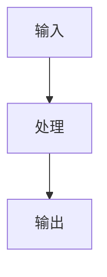

# 丰富阶段 Prompt

为结构化草稿补充内容，提升文章深度和可读性。

## 补充内容类型

1. **代码块**：如果文章涉及代码，补充完整可运行的代码示例
2. **表格**：对比类内容用表格呈现
3. **列表**：步骤、要点、注意事项用列表
4. **示意图**：流程图/架构图用 Mermaid 语法

## 代码块规范

- 使用正确的语言标注（cpp, python, typescript, bash 等）
- 代码要有注释（中文）
- 代码必须是完整可运行的片段
- 避免超过 30 行的代码块（太长拆分为多段）

## Mermaid 图表示例

## 输入

结构化草稿：
{{STRUCTURED_DRAFT}}

分析结果：
{{ANALYSIS_JSON}}
